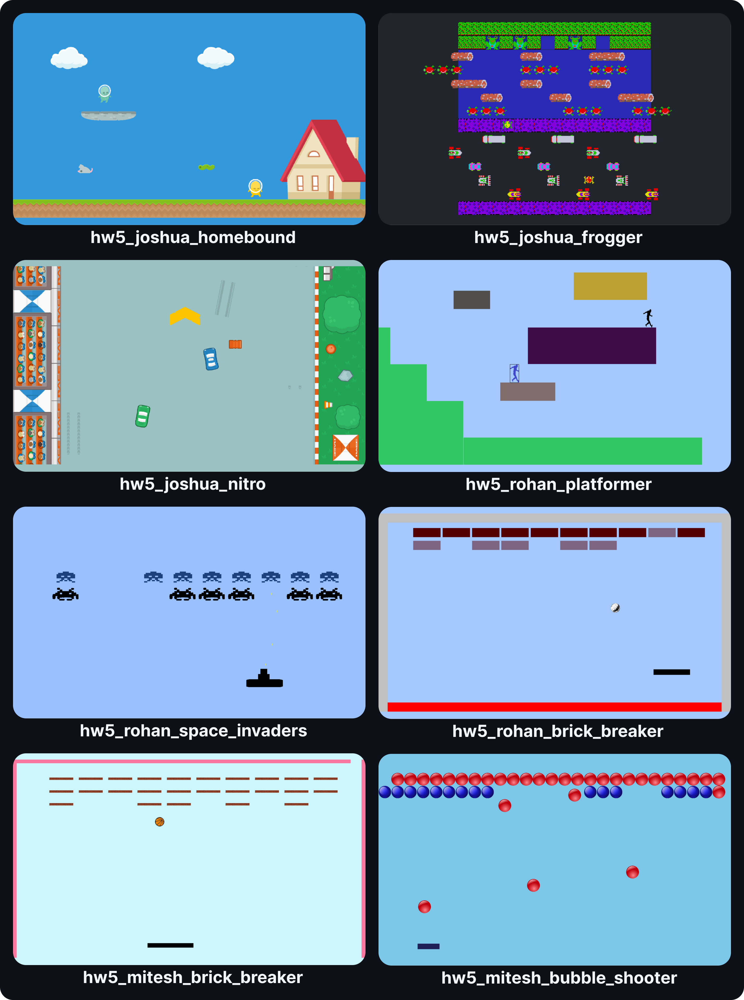

[](https://github.com/gef24-group/game-engine/actions/workflows/checks.yml)
[](https://github.com/gef24-group/game-engine/actions/workflows/build.yml)

# game-engine
This repo houses a cross-platform 2D game engine with built-in multiplayer support. Both client-server and peer-to-peer network architectures are supported. The engine also features an entity component system for constructing game objects, a physics engine, an input system with multi-key chord support, in-game timelines, side-scrolling mechanics, event management, game replay functionality, and profiling with the [Tracy](https://github.com/wolfpld/tracy) profiler.

## Installation
Pre-built game binaries for Windows, macOS and Ubuntu are available in [every release](https://github.com/gef24-group/game-engine/releases). After downloading the binaries of the latest release for your platform, navigate to the folder containing the game of your choice and run the commands specified below. You may choose between the client-server or peer-to-peer modes. Each command must be run in its own shell. Only a single server or host may be spawned, but you may spawn as many clients or peers as needed.

**Client-server mode**
```bash
./<GAME_BINARY> --mode cs --role server
./<GAME_BINARY> --mode cs --role client
```

**Peer-to-peer mode**
```bash
./<GAME_BINARY> --mode p2p --role host
./<GAME_BINARY> --mode p2p --role peer
```

To connect clients or peers with remote servers or hosts, you may specify the following flags
- `--server_ip` (on clients)
- `--host_ip` and `--peer_ip` (on peers)

For more details, refer to the section on [engine flags](#engine-flags)

## Build
### Prerequisites
This project uses CMake along with Ninja as the build system  
You may install a [pre built package](https://github.com/ninja-build/ninja/wiki/Pre-built-Ninja-packages) of Ninja on your platform  
Additionally, please ensure that the following dependencies are installed on your platform

#### Ubuntu 24.04
```bash
sudo apt update
sudo apt install build-essential x11-apps cmake
```

#### macOS Sequoia 15.1.1
Install Homebrew from [brew.sh](https://brew.sh/)
```bash
xcode-select --install
brew install cmake
```

#### Windows 11 Version 24H2
Install [Visual Studio 2022](https://visualstudio.microsoft.com/vs/) and choose the `Desktop development with C++` workload  
Please note that all the Windows commands will need to be run on `Developer PowerShell for VS 2022`

### Configure the build
Fetch dependent libraries and generate build files for your platform  
This is a one-time step and need not be done when rebuilding the project
```bash
make configure           # Ubuntu or macOS
.\scripts\configure.ps1  # Windows 11
```

### Build all games
Every folder in `src/games` maps to a game  
The [`.targetgames`](.targetgames) file defines all the games that are supported in the current build  
To build all games defined in [`.targetgames`](.targetgames), run
```bash
make                 # Ubuntu or macOS
.\scripts\build.ps1  # Windows 11
```

### Build a specific game
To build a specific game, set the `GAME` variable  
For example, if these are the games defined in [`.targetgames`](.targetgames)
```bash
hw5_joshua_homebound
hw5_rohan_space_invaders
hw5_rohan_brick_breaker
```
And you would like to only build `hw5_joshua_homebound`, then you would need to run
```bash
make GAME=hw5_joshua_homebound                  # Ubuntu or macOS
.\scripts\build.ps1 -GAME hw5_joshua_homebound  # Windows 11
```

## Play
After a game has been built, you may play it using this command
```bash
make play GAME=<game> ARGS="<game_args>"                  # Ubuntu or macOS
.\scripts\play.ps1 -GAME <game> -GAME_ARGS "<game_args>"  # Windows 11
```

## Engine flags
Most games include multi-player support, but require certain flags to be passed to the engine  
This is facilitated by the `ARGS` variable (`GAME_ARGS` on Windows)  
The flags supported by the engine are
```bash
--mode      [single, cs, p2p]             (default: single)
--role      [server, client, host, peer]  (default: client)
--encoding  [struct, json]                (default: struct)
--server_ip <ip_address>                  (default: localhost)
--host_ip   <ip_address>                  (default: localhost)
--peer_ip   <ip_address>                  (default: localhost)
```

## Examples
### Client-server mode (Ubuntu or macOS)
To run `hw5_joshua_homebound` in the client-server mode, run these commands in different shells

**Server**
```bash
make play GAME=hw5_joshua_homebound ARGS="--mode cs --role server"
```
**Client**
```bash
make play GAME=hw5_joshua_homebound ARGS="--mode cs --role client"
```

### Peer-to-peer mode (Ubuntu or macOS)
To run `hw5_rohan_space_invaders` in the peer-to-peer mode, run these commands in different shells

**Host**
```bash
make play GAME=hw5_rohan_space_invaders ARGS="--mode p2p --role host"
```
**Peer**
```bash
make play GAME=hw5_rohan_space_invaders ARGS="--mode p2p --role peer"
```

### Client mode (Windows 11)
To run `hw5_rohan_brick_breaker` in the client mode, run the following command  
This assumes that the server was already started on the same machine

**Client**
```bash
.\scripts\play.ps1 -GAME hw5_rohan_brick_breaker -GAME_ARGS "--mode cs --role client"
```

## Cleanup
To clear all build artifacts, run
```bash
make clean           # Ubuntu or macOS
.\scripts\clean.ps1  # Windows 11
```

## Common inputs
Here is a map of inputs common to every game

| Input        | Action                        |
|--------------|-------------------------------|
| <kbd>p</kbd> | Toggle timeline pause         |
| <kbd>,</kbd> | Slow down the timeline        |
| <kbd>.</kbd> | Speed up the timeline         |
| <kbd>x</kbd> | Toggle display scaling        |
| <kbd>z</kbd> | Toggle hidden zone visibility |
| <kbd>q</kbd> | Toggle recording              |
| <kbd>r</kbd> | Replay the recording          |

## Gallery


## References
Please find all references in [References.md](References.md)